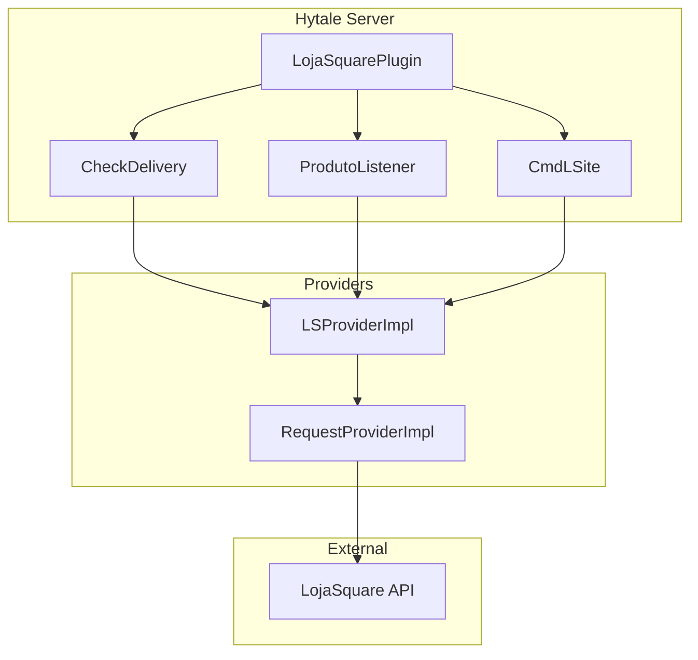
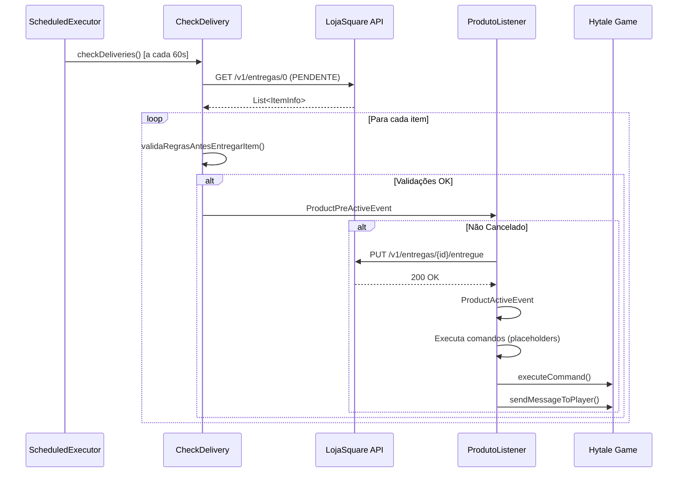
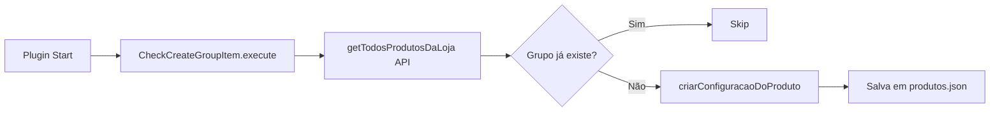

# LojaSquare - Plugin Hytale

> **Plugin de integração com a plataforma LojaSquare para entrega automática de produtos no Hytale**

[](https://www.oracle.com/java/)
[](https://maven.apache.org/)
[](https://hytale.com/)
[](https://lojasquare.com.br/)

---

## 📋 Índice

- [Sobre o Projeto](#-sobre-o-projeto)
- [Arquitetura](#-arquitetura)
- [Chamadas Externas à API](#-chamadas-externas-à-api)
- [Lógicas de Negócio](#-lógicas-de-negócio)
- [Sistema de Eventos](#-sistema-de-eventos)
- [Fluxo de Ativação/Entrega](#-fluxo-de-ativaçãoentrega)
- [Design Patterns](#-design-patterns)
- [Auto-Configuração](#-auto-configuração)
- [Sistema de Delivery](#-sistema-de-delivery)
- [Utilitários](#-utilitários)
- [API Hytale](#-api-hytale)
- [Configuração e Build](#-configuração-e-build)
- [Lições Aprendidas](#-lições-aprendidas)

---

## 🎯 Sobre o Projeto

### Finalidade

O **LojaSquare-Hytale** é um plugin que integra servidores Hytale com a plataforma **LojaSquare** (https://lojasquare.com.br/), permitindo a entrega automática de produtos digitais comprados pelos jogadores.

### Funcionalidades Principais

1. **Entrega Automática de Produtos**: Sistema que monitora compras no site LojaSquare e entrega produtos automaticamente no jogo
2. **Validação de Servidor**: Garante que produtos sejam entregues apenas no servidor correto
3. **Smart Delivery**: Opção para entregar múltiplas unidades de um produto de uma vez
4. **Auto-Configuração**: Cria automaticamente configurações para novos grupos de produtos
5. **Ativação de Conta**: Comando `/lsite ativar <codigo>` para vincular conta do site ao jogo
6. **Sistema de Placeholders**: Substitui variáveis nos comandos de entrega (ex: `@player`, `@produto`, `@qnt`)
7. **Validação de IP**: Verifica se o IP do servidor está autorizado na plataforma LojaSquare

### Histórico

Este projeto é o **port do plugin LojaSquare Bukkit/Spigot** para a API do Hytale. Toda a lógica de negócio foi preservada, adaptando apenas as chamadas de API específicas da plataforma.

---

## 🏗️ Arquitetura

### Estrutura de Pacotes

```
br.com.lojasquare/
├── LojaSquarePlugin.java          # Classe principal (JavaPlugin)
├── api/                            # Eventos customizados
│   ├── ProductActiveEvent.java    # Evento de ativação de produto
│   └── ProductPreActiveEvent.java # Evento pré-ativação (cancelável)
├── commands/                       # Sistema de comandos
│   └── CmdLSite.java              # Comando /lsite
├── core/                           # Lógicas de negócio
│   ├── CheckService.java          # Interface para serviços de checagem
│   ├── autoconfig/
│   │   └── CheckCreateGroupItem.java # Auto-criação de config de produtos
│   └── delivery/
│       └── CheckDelivery.java     # Sistema de verificação de entregas
├── listener/                       # Handlers de eventos
│   └── ProdutoListener.java       # Processa eventos de produto
├── providers/                      # Camada de integração
│   ├── lojasquare/
│   │   ├── ILSProvider.java       # Interface da API LojaSquare
│   │   └── impl/
│   │       └── LSProviderImpl.java # Implementação da API
│   └── request/
│       ├── IRequestProvider.java   # Interface HTTP client
│       └── impl/
│           └── RequestProviderImpl.java # Cliente HTTPS
└── utils/                          # Utilitários
    ├── ConfigManager.java         # Gerenciador de config JSON
    ├── DateDuration.java          # Medidor de tempo
    ├── HttpResponse.java          # DTO resposta HTTP
    ├── SiteUtil.java              # Config de conexão API
    ├── enums/
    │   ├── LSEntregaStatus.java   # Status de entrega
    │   └── LSResponseEnum.java    # Códigos de resposta
    └── model/
        ├── ItemInfo.java          # DTO de item/entrega
        ├── ProdutoInfo.java       # DTO de produto
        └── ValidaIpInfo.java      # DTO validação IP
```

### Diagrama de Componentes



---

## 🌐 Chamadas Externas à API

O plugin realiza **5 chamadas HTTP** para a API REST do LojaSquare:

### 1. GET /v1/entregas/{status}

**Método**: `LSProviderImpl.getTodasEntregas(LSEntregaStatus status)`  
**Finalidade**: Busca todas as entregas pendentes para o servidor  
**Autenticação**: Header `Authorization` com SECRET_API  
**Retorno**: `List<ItemInfo>` - Lista de entregas

```java
// Endpoint exemplo
GET https://api.lojasquare.net/v1/entregas/0?status=0
```

**Parâmetros**:
- `status`: `0` (PENDENTE), `1` (PROCESSANDO), `2` (ENTREGUE)

---

### 2. GET /v1/produtos

**Método**: `LSProviderImpl.getTodosProdutosDaLoja()`  
**Finalidade**: Lista todos os produtos cadastrados na loja  
**Query Params**: `tokenSubServidor` - Token do servidor  
**Retorno**: `List<ProdutoInfo>` - Produtos disponíveis

```java
// Endpoint exemplo
GET https://api.lojasquare.net/v1/produtos?tokenSubServidor=TOKEN
```

**Uso**: Utilizado pelo sistema de auto-configuração para criar configs de novos grupos.

---

### 3. PUT /v1/entregas/{id}/entregue

**Método**: `LSProviderImpl.updateDelivery(ItemInfo ii)`  
**Finalidade**: Marca uma entrega como concluída  
**Parâmetros de URL**: `id` - ID da entrega  
**Retorno**: `boolean` - Sucesso/falha

```java
// Endpoint exemplo
PUT https://api.lojasquare.net/v1/entregas/12345/entregue
```

**Fluxo**: Chamado **antes** de executar comandos de entrega.

---

### 4. PUT /v1/clientes/activate

**Método**: `LSProviderImpl.activateAccount(String codigo, String usuario)`  
**Finalidade**: Ativa conta de usuário vinculando ao jogador  
**Query Params**: 
- `codigo` - Código de ativação
- `usuario` - Nick do jogador  
**Retorno**: `boolean` - Sucesso/falha

```java
// Endpoint exemplo
PUT https://api.lojasquare.net/v1/clientes/activate?codigo=ABC123&usuario=PlayerName
```

**Comando Associado**: `/lsite ativar <codigo>`

---

### 5. GET /v1/sites/extensoes

**Método**: `LSProviderImpl.getIpMaquina()`  
**Finalidade**: Valida IP do servidor  
**Autenticação**: Header `Authorization`  
**Retorno**: `ValidaIpInfo` - IP autorizado e status de sucesso

```java
// Endpoint exemplo
GET https://api.lojasquare.net/v1/sites/extensoes
```

**Validação**: Chamado no `start()` do plugin para garantir que o servidor está autorizado.

---

### HTTP Client - RequestProviderImpl

Implementação customizada usando `HttpsURLConnection`:

**Características**:
- Suporta HTTPS com certificado autoassinado
- Timeout configurável (Connection + Read)
- Header `Authorization` automático
- Parsing JSON com Gson

**Métodos**:
- `get(String url)` - Requisição GET
- `put(String url)` - Requisição PUT

---

## ⚙️ Lógicas de Negócio

### 7 Validações Antes de Entregar um Produto

O sistema `CheckDelivery` valida **7 regras de negócio** antes de realizar qualquer entrega:

#### 1. Item Não Pode ser Null

```java
if (Objects.isNull(item)) return false;
```

**Impacto**: Evita NullPointerException.

---

#### 2. Status Não Pode ser ENTREGUE (statusID=2)

```java
if (item.getStatusID() == 2) return false;
```

**Impacto**: Previne entrega duplicada de produtos já entregues.

---

#### 3. Servidor Deve Corresponder

```java
if (!item.getSubServidor().equalsIgnoreCase(servidor)) return false;
```

**Configuração**: `config.json` → `LojaSquare.Servidor`  
**Impacto**: Garante que produtos comprados para "SkyBlock" não sejam entregues no servidor "Survival".

---

#### 4. Grupo Deve Estar Configurado e Ativado

```java
if (!plugin.produtoAtivado(item.getGrupo())) return false;
```

**Configuração**: `produtos.json` → `Grupos.<nome>.Ativado = true`  
**Impacto**: Administradores podem desabilitar temporariamente entregas de um grupo específico.

---

#### 5. Player Online (Dependendo da Configuração)

```java
if (playerUUID == null && !config.getBoolean("...Ativar_Com_Player_Offline")) {
    return false;
}
```

**Configuração**: `produtos.json` → `Grupos.<nome>.Ativar_Com_Player_Offline`  
**Exceções**: Produtos dos grupos `DISPUTA` e `RESOLVIDO` sempre entregam offline (entregas administrativas).

---

#### 6. Inventário Vazio (Dependendo da Configuração)

```java
if (config.getBoolean("...Entregar_Apenas_Com_Inventario_Vazio")) {
    if (!plugin.isPlayerInventoryEmpty(playerUUID)) {
        return false;
    }
}
```

**Configuração**: `produtos.json` → `Grupos.<nome>.Entregar_Apenas_Com_Inventario_Vazio`  
**Uso**: Para produtos que dão itens físicos e requerem espaço no inventário.

---

#### 7. Nick Compatível

```java
if (playerName != null && !itemInfo.getPlayer().equalsIgnoreCase(playerName)) {
    return false;
}
```

**Impacto**: Garante que o produto seja entregue ao jogador correto (case-insensitive).

---

### Smart Delivery

**Configuração**: `config.json` → `LojaSquare.Smart_Delivery = true/false`

**Comportamento**:
- `true` (Smart): Executa comandos **1 vez** com quantidade total (`@qnt` * quantidade comprada)
- `false` (Normal): Executa comandos **N vezes** (uma para cada unidade comprada)

**Exemplo**:
```
Compra: 3x VIP Mensal
Smart ON:  gerarvip mensal @player 30 dias 3 unidades (1x)
Smart OFF: gerarvip mensal @player 30 dias 1 unidade (3x)
```

---

## 🎪 Sistema de Eventos

### Eventos Customizados

O plugin implementa **2 eventos customizados** que seguem o padrão de eventos do Hytale:

#### ProductPreActiveEvent

**Disparado**: Antes de marcar entrega como concluída na API  
**Cancelável**: ✅ Sim  
**Uso**: Permite que outros plugins interceptem e cancelem entregas

```java
public class ProductPreActiveEvent {
    @Getter @Setter private boolean cancelled;
    @Getter private final UUID playerUUID;
    @Getter private final String playerName;
    @Getter private final ItemInfo itemInfo;
}
```

**Handler**: `ProdutoListener.handlePreActive()`

**Fluxo**:
1. CheckDelivery dispara o evento
2. Se não cancelado, chama `LSProvider.updateDelivery()`
3. Se API confirma, dispara `ProductActiveEvent`

---

#### ProductActiveEvent

**Disparado**: Após confirmação da API (entrega marcada como concluída)  
**Cancelável**: ✅ Sim (mas já foi marcado como entregue na API)  
**Uso**: Executa comandos de entrega configurados

```java
public class ProductActiveEvent {
    @Getter @Setter private boolean cancelled;
    @Getter private final UUID playerUUID;
    @Getter private final String playerName;
    @Getter private final ItemInfo itemInfo;
}
```

**Handler**: `ProdutoListener.handleActiveDelivery()`

**Fluxo**:
1. Busca configurações do grupo
2. Calcula valores (money, smart delivery)
3. Executa comandos substituindo placeholders
4. Envia mensagem ao jogador

---

### Registro de Eventos

**Nota**: O registro de eventos está preparado mas **aguarda integração com `EventBus` da API Hytale**:

```java
// TODO: Registrar via HytaleServer.get().getEventBus().register(...)
produtoListener = new ProdutoListener(this, lsProvider);
```

---

## 🔄 Fluxo de Ativação/Entrega

### Diagrama de Sequência



### Passo a Passo Detalhado

#### 1. Checagem Periódica

```java
// A cada 60 segundos (configurável)
scheduler.scheduleAtFixedRate(
    this::checkDeliveries,
    10,  // delay inicial
    plugin.getTempoChecarItens(),  // intervalo
    TimeUnit.SECONDS
);
```

**Configuração**: `config.json` → `Config.Tempo_Checar_Compras`

---

#### 2. Busca de Entregas Pendentes

```java
List<ItemInfo> itens = lsProvider.getTodasEntregas(LSEntregaStatus.PENDENTE);
```

**Endpoint**: `GET /v1/entregas/0?status=0`

---

#### 3. Validação de Regras de Negócio

```java
for (ItemInfo item : itens) {
    if (!validaRegrasAntesEntregarItem(item)) continue;
    // ...
}
```

**Valida**: 7 regras (ver seção "Lógicas de Negócio")

---

#### 4. Evento Pre-Active

```java
ProductPreActiveEvent event = new ProductPreActiveEvent(playerUUID, playerName, item);
plugin.handleProductPreActiveEvent(event);
```

**Se cancelado**: Entrega é abortada (não é marcada como entregue na API).

---

#### 5. Atualização da API

```java
if (lsProvider.updateDelivery(ii)) {
    // Sucesso - dispara evento de ativação
}
```

**Endpoint**: `PUT /v1/entregas/{id}/entregue`  
**Importância**: Marca como entregue **antes** de executar comandos para evitar duplicação.

---

#### 6. Evento Active

```java
ProductActiveEvent activeEvent = new ProductActiveEvent(playerUUID, playerName, ii);
plugin.handleProductActiveEvent(activeEvent);
```

---

#### 7. Execução de Comandos

```java
// Busca comandos configurados
List<String> listCmds = plugin.getConfGrupos()
    .getStringList("Grupos." + ii.getGrupo() + ".Cmds_A_Executar");

// Smart Delivery
if (smartDelivery) {
    for (String cmd : listCmds) {
        cmd = replaceString(ii, cmd, qntMoneyInteiro, qntMoney);
        plugin.executeCommand(cmd);
    }
}
```

**Placeholders Substituídos**:
- `@player` → Nome do jogador
- `@produto` → Nome do produto
- `@grupo` → Grupo do produto
- `@qnt` → Quantidade
- `@dias` → Dias do produto
- `@money` → Valor monetário (double)
- `@moneyInteiro` → Valor monetário (int)
- `@cupom` → Código do cupom

---

#### 8. Envio de Mensagem

```java
if (config.getBoolean("Grupos." + ii.getGrupo() + ".Enviar_Mensagem")) {
    List<String> messages = config.getStringList(...);
    for (String msg : messages) {
        msg = msg.replace("&", "§");  // Cores Minecraft
        msg = replaceString(ii, msg, 0, 0);
        plugin.sendMessageToPlayer(playerUUID, msg);
    }
}
```

---

## 🎨 Design Patterns

### 1. Strategy Pattern

**Onde**: `CheckService` interface

```java
public interface CheckService {
    void execute();
}
```

**Implementações**:
- `CheckCreateGroupItem` - Estratégia de auto-configuração
- `CheckDelivery` - Estratégia de verificação de entregas

**Benefício**: Permite adicionar novos tipos de checagens sem modificar `LojaSquarePlugin`.

---

### 2. Provider Pattern

**Onde**: `ILSProvider` e `IRequestProvider`

```java
public interface ILSProvider {
    List<ItemInfo> getTodasEntregas(LSEntregaStatus status);
    // ...
}
```

**Benefício**: Abstrai a implementação de comunicação com API, facilitando testes e mocks.

---

### 3. Builder Pattern

**Onde**: `HttpResponse`, `ValidaIpInfo` (via Lombok `@Builder`)

```java
ValidaIpInfo.builder()
    .ip("192.168.0.1")
    .sucesso(true)
    .build();
```

**Benefício**: Construção fluente de DTOs.

---

### 4. Singleton Pattern

**Onde**: `LojaSquarePlugin.getInstance()`

```java
private static LojaSquarePlugin instance;

public static LojaSquarePlugin getInstance() {
    return instance;
}
```

**Benefício**: Acesso global ao plugin de qualquer classe.

---

### 5. Observer Pattern

**Onde**: Sistema de eventos (`ProductPreActiveEvent`, `ProductActiveEvent`)

**Benefício**: Desacoplamento entre detecção de entregas (`CheckDelivery`) e processamento (`ProdutoListener`).

---

### 6. Template Method Pattern

**Onde**: Lifecycle do `JavaPlugin`

```java
@Override
protected void setup() { /* ... */ }

@Override
protected void start() { /* ... */ }

@Override
protected void shutdown() { /* ... */ }
```

**Benefício**: Hytale API define a estrutura, plugin implementa os passos.

---

## 🔧 Auto-Configuração

### CheckCreateGroupItem

**Finalidade**: Criar automaticamente configuração padrão para novos grupos de produtos.

**Fluxo**:



**Código**:

```java
public void execute() {
    List<String> gruposConfigPlugin = plugin.getProdutosConfigurados();
    List<String> gruposDeProdutosNoSite = getListaGruposProdutosDaLoja();
    
    for (String grupoSite : gruposDeProdutosNoSite) {
        if (gruposConfigPlugin.contains(grupoSite)) continue;
        criarConfiguracaoDoProduto(grupoSite);
    }
}
```

**Configuração Default Criada**:

```json
{
  "Grupos": {
    "NomeDoGrupo": {
      "Ativado": false,
      "Ativar_Com_Player_Offline": false,
      "Enviar_Mensagem": false,
      "Mensagem_Receber_Ao_Ativar_Produto": [
        "&eOla &a@player",
        "&eO produto que voce adquiriu (&a@produto&e) foi ativado!",
        "&eDias: &a@dias",
        "&eQuantidade: &a@qnt"
      ],
      "Money": false,
      "Quantidade_De_Money": 0,
      "Cmds_A_Executar": [
        "gerarvip NomeDoGrupo @dias @qnt @player"
      ]
    }
  }
}
```

**Importância**: Evita erro `Produto não configurado` para produtos novos.

---

## 📦 Sistema de Delivery

### CheckDelivery

**Responsabilidades**:
1. Agendar checagens periódicas
2. Buscar entregas pendentes
3. Validar regras de negócio
4. Disparar eventos de pré-ativação

**Ciclo de Vida**:

```java
// Inicialização
public CheckDelivery(LojaSquarePlugin plugin, ILSProvider lsProvider) {
    this.plugin = plugin;
    this.lsProvider = lsProvider;
    this.scheduler = Executors.newSingleThreadScheduledExecutor();
}

// Execução
@Override
public void execute() {
    scheduler.scheduleAtFixedRate(
        this::checkDeliveries,
        10,
        plugin.getTempoChecarItens(),
        TimeUnit.SECONDS
    );
}

// Shutdown
public void shutdown() {
    if (scheduler != null && !scheduler.isShutdown()) {
        scheduler.shutdown();
        scheduler.awaitTermination(5, TimeUnit.SECONDS);
    }
}
```

**Thread Safety**: Usa `ScheduledExecutorService` para execução assíncrona.

---

### Métodos de Validação

#### checaServidorCorretoEntregarItem()

Valida se o produto é para este servidor.

```java
if (!item.getSubServidor().equalsIgnoreCase(servidor)) {
    plugin.printDebug("Servidor incorreto");
    return false;
}
```

---

#### checaItemNaConfig()

Valida se o grupo do produto está configurado e ativado.

```java
if (!plugin.produtoAtivado(item.getGrupo())) {
    plugin.sendMessageToPlayer(playerUUID, "Produto não configurado");
    return false;
}
```

---

#### checaEntregarComPlayerOffline()

Valida se pode entregar com player offline.

```java
if (playerUUID == null) {
    if (!config.getBoolean("...Ativar_Com_Player_Offline")) {
        // Exceções: DISPUTA e RESOLVIDO
        boolean isException = /* ... */;
        if (!isException) return false;
    }
}
```

---

#### checaPlayerInvVazio()

Valida se o inventário está vazio (se requerido).

```java
if (config.getBoolean("...Entregar_Apenas_Com_Inventario_Vazio")) {
    if (!plugin.isPlayerInventoryEmpty(playerUUID)) {
        plugin.sendMessageToPlayer(playerUUID, "Limpe seu inventário");
        return false;
    }
}
```

---

#### isNickCompativelComEntrega()

Valida se o nick do player online corresponde ao da compra.

```java
return itemInfo.getPlayer().equalsIgnoreCase(playerName);
```

---

## 🛠️ Utilitários

### ConfigManager

**Finalidade**: Gerenciador de arquivos JSON de configuração (equivalente ao `YamlConfiguration` do Bukkit).

**Métodos**:
- `getString(String path)` - Busca valor String
- `getBoolean(String path, boolean def)` - Busca booleano com default
- `getInt(String path, int def)` - Busca inteiro
- `getDouble(String path, double def)` - Busca double
- `getStringList(String path)` - Busca lista de Strings
- `getKeys(String path)` - Busca chaves de seção
- `set(String path, Object value)` - Define valor
- `save()` - Salva no disco

**Exemplo de Uso**:

```java
ConfigManager config = new ConfigManager("config", plugin);
boolean debug = config.getBoolean("LojaSquare.Debug", true);
String servidor = config.getString("LojaSquare.Servidor");
```

**Path Notation**: Usa `.` para navegação (ex: `"Grupos.VIP.Ativado"`)

---

### SiteUtil

**Finalidade**: Armazena configurações de conexão com a API LojaSquare.

**Propriedades**:
- `credencial` - SECRET_API (cabeçalho Authorization)
- `tokenServidor` - Token de identificação do sub-servidor
- `serverRequest` - URL base da API (`https://api.lojasquare.net`)
- `connectionTimeout` - Timeout de conexão (ms)
- `readTimeout` - Timeout de leitura (ms)
- `debug` - Flag de debug
- `ipMaquina` - IP validado do servidor

---

### DateDuration

**Finalidade**: Medir duração de operações para debug/log.

```java
DateDuration dd = new DateDuration();
// ... operação ...
long millis = dd.getLongTime();
long seconds = dd.getSecondTime();
```

---

### HttpResponse

**Finalidade**: DTO para respostas HTTP.

```java
@Builder
public class HttpResponse {
    private int code;           // HTTP status code
    private JsonElement object; // Corpo da resposta (Gson)
}
```

---

### Enums

#### LSEntregaStatus

Status de uma entrega.

```java
public enum LSEntregaStatus {
    PENDENTE(0),
    PROCESSANDO(1),
    ENTREGUE(2);
    
    private final int code;
}
```

---

#### LSResponseEnum

Mensagens de resposta padronizadas da API.

```java
public enum LSResponseEnum {
    SUCESSO("Sucesso"),
    ERRO_GENERICO("Erro genérico"),
    // ...
}
```

---

### Models (DTOs)

#### ItemInfo

DTO de item/entrega.

```java
@Data
public class ItemInfo {
    private int entregaID;
    private int transacaoID;
    private String codigo;        // Código da transação
    private String produto;       // Nome do produto
    private String grupo;         // Grupo do produto
    private String player;        // Nick do jogador
    private int quantidade;       // Quantidade comprada
    private int dias;            // Dias (para produtos temporários)
    private String cupom;        // Código do cupom (pode ser null)
    private int statusID;        // Status (0=PENDENTE, 2=ENTREGUE)
    private String subServidor;  // Nome do servidor destino
}
```

---

#### ProdutoInfo

DTO de produto.

```java
@Data
public class ProdutoInfo {
    private int id;
    private String nome;
    private String grupo;
    private double preco;
}
```

---

#### ValidaIpInfo

DTO de validação de IP.

```java
@Builder
public class ValidaIpInfo {
    private String ip;
    private boolean sucesso;
}
```

---

## 🎮 API Hytale

### Classe Base: JavaPlugin

**Namespace**: `com.hypixel.hytale.server.core.plugin.JavaPlugin`

**Construtor Obrigatório**:

```java
public LojaSquarePlugin(@Nonnull JavaPluginInit init) {
    super(init);
}
```

**Lifecycle Methods**:

#### setup()

Chamado durante a fase de setup do servidor (antes de `start`).

```java
@Override
protected void setup() {
    super.setup();
    log("[LojaSquare] Carregando configuracoes...");
}
```

**Uso**: Inicialização leve, preparação.

---

#### start()

Chamado quando o servidor está pronto e os plugins devem ser ativados.

```java
@Override
protected void start() {
    super.start();
    defineVariaveisAmbiente();
    carregaGruposEntregaConfigurados();
    prepareWebServiceConnection(keyapi);
    checarIPCorreto(keyapi);
    registraEventosCmds();
    checagensDeInicializacao();
}
```

**Uso**: Inicialização completa, registro de eventos/comandos, início de tasks.

---

#### shutdown()

Chamado quando o servidor está desligando.

```java
@Override
protected void shutdown() {
    super.shutdown();
    if (checkDelivery != null) {
        checkDelivery.shutdown();  // Para o ScheduledExecutorService
    }
}
```

**Uso**: Limpeza, fechamento de conexões, parada de threads.

---

### Diferenças Bukkit → Hytale

| Bukkit/Spigot | Hytale | Mudança |
|---------------|--------|---------|
| `onEnable()` | `start()` | Método renomeado |
| `onDisable()` | `shutdown()` | Método renomeado |
| `getDataFolder()` | Manual: `Paths.get("mods", "LojaSquare")` | Sem método nativo |
| `BukkitRunnable` | `ScheduledExecutorService` | Async/Scheduler Java puro |
| `@EventHandler` | `EventBus.register()` | Sistema diferente |
| `CommandExecutor` | Classe customizada | Sem interface padrão |
| `YamlConfiguration` | JSON + Gson | Formato de config |
| `ConsoleCommandSender` | `System.out.println()` | Logging simplificado |

---

### Stubs Criados para Compilação

Como a API do Hytale não está disponível publicamente em repositórios Maven, foram criados **stubs** mínimos para permitir a compilação:

#### JavaPlugin (Stub)

```java
package com.hypixel.hytale.server.core.plugin;

public abstract class JavaPlugin {
    private final JavaPluginInit init;

    public JavaPlugin(@Nonnull JavaPluginInit init) {
        this.init = init;
    }

    protected void setup() {}
    protected void start() {}
    protected void shutdown() {}

    public Path getPluginDataFolder() {
        return init.getDataFolder();
    }

    public CommandRegistry getCommandRegistry() {
        return new CommandRegistry();
    }
}
```

**Importante**: Esses stubs são **excluídos do JAR final** via Maven Shade Plugin para não conflitar com a API real do servidor.

```xml
<filter>
    <artifact>*:*</artifact>
    <excludes>
        <exclude>com/hypixel/**</exclude>
    </excludes>
</filter>
```

---

### Métodos de Integração com Hytale (TODOs)

Alguns métodos atualmente retornam stubs e precisam ser integrados com a API real:

#### getPlayerUUID()

**Atual**: Busca em `ConcurrentHashMap` local.  
**Ideal**: Usar API Hytale para buscar player online.

```java
// TODO: HytaleServer.get().getPlayerManager().getPlayer(playerName)
```

---

#### sendMessageToPlayer()

**Atual**: Log para console.  
**Ideal**: Enviar mensagem via API Hytale.

```java
// TODO: player.sendMessage(message)
```

---

#### executeCommand()

**Atual**: Log para console.  
**Ideal**: Executar comando no servidor.

```java
// TODO: HytaleServer.get().getCommandManager().execute(command)
```

---

#### isPlayerInventoryEmpty()

**Atual**: Sempre retorna `true`.  
**Ideal**: Verificar inventário via API Hytale.

```java
// TODO: player.getInventory().isEmpty()
```

---

## 🚀 Configuração e Build

### Requisitos

- **Java**: 11+
- **Maven**: 3.6+
- **Servidor Hytale**: Com suporte a plugins Java

### Dependências

```xml
<!-- Lombok (compile-time) -->
<dependency>
    <groupId>org.projectlombok</groupId>
    <artifactId>lombok</artifactId>
    <version>1.18.32</version>
    <scope>provided</scope>
</dependency>

<!-- Gson (embedded) -->
<dependency>
    <groupId>com.google.code.gson</groupId>
    <artifactId>gson</artifactId>
    <version>2.10.1</version>
</dependency>

<!-- JSR305 (compile-time) -->
<dependency>
    <groupId>com.google.code.findbugs</groupId>
    <artifactId>jsr305</artifactId>
    <version>3.0.2</version>
    <scope>provided</scope>
</dependency>
```

---

### Build

```bash
# Clean e build
mvn clean package -DskipTests

# Localização do JAR
ls target/LojaSquare-Hytale-2.0-SNAPSHOT.jar
```

**Tamanho**: ~332 KB (com Gson embutido)

---

### Instalação

1. Copiar JAR para `mods/` do servidor Hytale:

```bash
cp target/LojaSquare-Hytale-2.0-SNAPSHOT.jar <servidor-hytale>/mods/
```

2. Configurar `config.json`:

```json
{
  "LojaSquare": {
    "SECRET_API": "sua-chave-api-aqui",
    "Servidor": "nome-do-seu-servidor",
    "Token_Servidor": "token-do-servidor"
  }
}
```

3. Ativar grupos em `produtos.json`:

```json
{
  "Grupos": {
    "VIP": {
      "Ativado": true,
      "Cmds_A_Executar": [
        "lp user @player parent set vip",
        "tell @player Você recebeu VIP!"
      ]
    }
  }
}
```

4. Reiniciar servidor.

---

### Estrutura de Arquivos em Produção

```
mods/
├── LojaSquare-Hytale-2.0-SNAPSHOT.jar
└── LojaSquare/
    ├── config.json      (criado automaticamente)
    └── produtos.json    (criado automaticamente)
```

---

## 📚 Lições Aprendidas

### Erros Comuns Durante o Desenvolvimento

#### 1. Imports com Prefixo "main.java"

**Problema**: VSCode Java Extension organizava imports incorretamente:

```java
// ERRADO
import main.java.br.com.lojasquare.api.ProductActiveEvent;

// CORRETO
import br.com.lojasquare.api.ProductActiveEvent;
```

**Causa**: IDE interpreta `src/main/java` como parte do pacote.

**Solução**:
```bash
# Correção via sed
find . -name "*.java" -exec sed -i 's/main\.java\.br\.com\.lojasquare/br.com.lojasquare/g' {} \;
```

**Prevenção**: Usar Maven para build (não depende do IDE).

---

#### 2. Stubs da API Hytale no JAR Final

**Problema**: Stubs criados para compilação eram incluídos no JAR e conflitavam com a API real do servidor.

**Erro**:
```
ClassCastException: br.com.lojasquare.LojaSquarePlugin does not extend JavaPlugin
```

**Causa**: JAR continha `com.hypixel.hytale.server.core.plugin.JavaPlugin` stub em vez de usar a classe do servidor.

**Solução**: Exclusão via Maven Shade Plugin:

```xml
<filters>
    <filter>
        <artifact>*:*</artifact>
        <excludes>
            <exclude>com/hypixel/**</exclude>
        </excludes>
    </filter>
</filters>
```

**Prevenção**: Sempre excluir stubs de APIs fornecidas pelo servidor.

---

#### 3. Método getPluginDataFolder() Não Existe

**Problema**: Chamada a `getPluginDataFolder()` falhou em runtime.

**Erro**:
```
NoSuchMethodError: 'java.nio.file.Path br.com.lojasquare.LojaSquarePlugin.getPluginDataFolder()'
```

**Causa**: Método stub não existia na API real.

**Solução**: Usar path fixo:

```java
// ANTES (stub)
return this.getPluginDataFolder();

// DEPOIS (funcional)
return java.nio.file.Paths.get("mods", "LojaSquare");
```

**Prevenção**: Consultar documentação oficial da API ou descompilar o JAR do servidor.

---

#### 4. Manifest.json vs Plugin.json

**Problema**: Plugin não carregava no servidor.

**Erro**:
```
Failed to load pending plugin. Failed to load manifest file!
```

**Causa**: Arquivo estava nomeado `plugin.json` mas o Hytale espera `manifest.json`.

**Solução**: Renomear para `manifest.json` com estrutura correta:

```json
{
  "Group": "TrowDev",
  "Name": "LojaSquare",
  "Main": "br.com.lojasquare.LojaSquarePlugin",
  "ServerVersion": "*"
}
```

**Nota**: Propriedade `Main` com M maiúsculo (não `main`).

---

### Como Criar o Projeto Corretamente

#### Passo 1: Estrutura Base

```bash
mkdir -p LojaSquare-Hytale/src/main/{java,resources}
cd LojaSquare-Hytale
```

---

#### Passo 2: Criar pom.xml

```xml
<?xml version="1.0" encoding="UTF-8"?>
<project xmlns="http://maven.apache.org/POM/4.0.0">
    <modelVersion>4.0.0</modelVersion>
    
    <groupId>br.com.lojasquare</groupId>
    <artifactId>LojaSquare-Hytale</artifactId>
    <version>1.0.0</version>
    
    <properties>
        <java.version>11</java.version>
    </properties>
    
    <!-- Dependências e plugins aqui -->
</project>
```

---

#### Passo 3: Configurar Maven Shade Plugin

```xml
<plugin>
    <groupId>org.apache.maven.plugins</groupId>
    <artifactId>maven-shade-plugin</artifactId>
    <version>3.5.1</version>
    <executions>
        <execution>
            <phase>package</phase>
            <goals>
                <goal>shade</goal>
            </goals>
            <configuration>
                <minimizeJar>true</minimizeJar>
                <filters>
                    <filter>
                        <artifact>*:*</artifact>
                        <excludes>
                            <exclude>com/hypixel/**</exclude>
                        </excludes>
                    </filter>
                </filters>
            </configuration>
        </execution>
    </executions>
</plugin>
```

---

#### Passo 4: Criar manifest.json

```json
{
  "Group": "TrowDev",
  "Name": "LojaSquare",
  "Version": "1.0.0",
  "Main": "br.com.lojasquare.LojaSquarePlugin",
  "ServerVersion": "*"
}
```

**Importante**: `Main` com M maiúsculo.

---

#### Passo 5: Criar Classe Principal

```java
package br.com.lojasquare;

import com.hypixel.hytale.server.core.plugin.JavaPlugin;
import com.hypixel.hytale.server.core.plugin.JavaPluginInit;
import javax.annotation.Nonnull;

public class LojaSquarePlugin extends JavaPlugin {
    
    public LojaSquarePlugin(@Nonnull JavaPluginInit init) {
        super(init);
    }
    
    @Override
    protected void start() {
        super.start();
        System.out.println("[LojaSquare] Plugin iniciado!");
    }
}
```

---

#### Passo 6: Criar Stubs (se API não disponível)

```java
// src/main/java/com/hypixel/hytale/server/core/plugin/JavaPlugin.java
package com.hypixel.hytale.server.core.plugin;

import javax.annotation.Nonnull;

public abstract class JavaPlugin {
    protected JavaPlugin(@Nonnull JavaPluginInit init) {}
    protected void setup() {}
    protected void start() {}
    protected void shutdown() {}
}
```

---

#### Passo 7: Build e Deploy

```bash
# Build
mvn clean package -DskipTests

# Verificar exclusões
jar tf target/LojaSquare-Hytale-1.0.0.jar | grep "com/hypixel"
# (deve retornar vazio)

# Deploy
cp target/LojaSquare-Hytale-1.0.0.jar <servidor>/mods/
```

---

### Checklist de Validação

- [ ] `manifest.json` existe e está correto (Main com M maiúsculo)
- [ ] `pom.xml` exclui stubs (`com/hypixel/**`)
- [ ] Classe principal estende `JavaPlugin` e tem construtor `JavaPluginInit`
- [ ] Métodos `setup()`, `start()`, `shutdown()` implementados
- [ ] Path de dados usa `Paths.get("mods", "NomePlugin")` (não depende de API)
- [ ] Imports corretos (sem `main.java.`)
- [ ] JAR final não contém `com/hypixel/**`
- [ ] Build Maven sem erros

---

## 📝 Notas Adicionais

### Segurança

- **SECRET_API**: Nunca commitar no Git. Usar variáveis de ambiente ou arquivo `.env` ignorado.
- **HTTPS**: API usa HTTPS. Plugin aceita certificados autoassinados via `TrustManager`.

### Performance

- **ScheduledExecutorService**: 1 thread para checagem periódica.
- **CompletableFuture**: Chamadas API são assíncronas.
- **Minimização JAR**: Maven Shade remove classes não usadas (467 → 464 classes).

### Logs

- **Debug Mode**: `config.json` → `LojaSquare.Debug = true`
- **Método**: `plugin.printDebug(msg)` - só loga se debug ativado.

---

## 🤝 Contribuindo

1. Fork o projeto
2. Crie uma branch (`git checkout -b feature/nova-funcionalidade`)
3. Commit suas mudanças (`git commit -m 'Adiciona nova funcionalidade'`)
4. Push para a branch (`git push origin feature/nova-funcionalidade`)
5. Abra um Pull Request

---

## 📄 Licença

Este projeto é privado e de propriedade da **LojaSquare / TrowDev**.

---

## 📧 Contato

- **Website**: https://lojasquare.com.br
- **Email**: admin@lojasquare.com.br
- **Autor**: TrowDev

---

**README.md gerado com extrema riqueza de detalhes para o projeto LojaSquare-Hytale**
